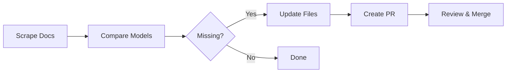

# Model Sync Workflow - Quick Reference

## What It Does
Automatically keeps model configuration files synchronized with GitHub Copilot's official documentation.

## Files It Updates
- `src/tokenEstimators.json` - Character-to-token ratios
- `src/modelPricing.json` - Pricing per million tokens

## When It Runs
- 🗓️ **Weekly**: Every Monday at 5:11 PM UTC (chosen to avoid peak CI hours)
- 🔧 **Manual**: Run `gh workflow run check-models.yml`
- 📝 **On Changes**: When workflow or prompt files are modified

## What Happens



### Step by Step

1. **Scrape** - Fetches model list from https://docs.github.com/en/copilot/reference/ai-models/supported-models
2. **Compare** - Checks what's missing from local JSON files
3. **Update** - Adds missing models with defaults:
   - Token estimators: `0.25` ratio
   - Pricing: `$0.00` (needs verification)
4. **PR** - Creates pull request for review

## Demo

Run the interactive demo to see it in action:

```bash
cd .github/scripts
bash demo-sync-models.sh
```

**What you'll see:**
- ✅ Sample data creation
- 📊 Current state analysis
- 🔍 Gap identification
- ➕ Automatic updates
- 📝 Change visualization
- ✓ JSON validation

## Manual Workflow Execution

### Using GitHub CLI
```bash
gh workflow run check-models.yml
```

### Using GitHub UI
1. Go to **Actions** tab
2. Select **Sync Copilot Models** workflow
3. Click **Run workflow**
4. Select branch (usually `main`)
5. Click **Run workflow** button

## Review a PR

When the workflow creates a PR:

1. **Check the changes**
   - Verify new models are real
   - Confirm ratios make sense (0.25 for GPT, 0.24 for Claude)

2. **Update pricing**
   - Models with `$0.00` need manual pricing
   - Check official API pricing pages
   - Update the PR or merge and fix later

3. **Merge**
   - Once pricing is verified, merge the PR
   - The extension will use the new data immediately

## Architecture

### Components

```
.github/
├── scripts/
│   ├── scrape-models.js          # Puppeteer web scraper
│   ├── demo-sync-models.sh       # Demo script
│   └── package.json              # Dependencies
└── workflows/
    ├── check-models.yml          # Main workflow
    └── prompts/
        └── sync-models-prompt.md # Copilot CLI instructions
```

### Data Flow

```
GitHub Docs → Scraper → scraped-models.json
                              ↓
                    Copilot CLI (with prompt)
                              ↓
              ┌───────────────┴───────────────┐
              ↓                               ↓
    tokenEstimators.json            modelPricing.json
              ↓                               ↓
              └───────────────┬───────────────┘
                              ↓
                         Pull Request
```

## Troubleshooting

### Scraper Fails
- **SSL Error**: CI environment certificate issues
- **Selector Changed**: GitHub updated their docs structure
- **Solution**: Check artifacts for `scraper.log` and `page-content.html`

### No PR Created
- **No Changes**: All models already exist
- **Expected**: Workflow logs "Model data files were already up to date"

### Wrong Pricing
- **Default $0.00**: Intentional placeholder
- **Action**: Update pricing manually before or after merge
- **Sources**: Check `src/README.md` for pricing URLs

## Best Practices

### Before Merging
- [ ] Verify all new models are legitimate
- [ ] Check token estimator ratios match model families
- [ ] Update pricing for any $0.00 entries
- [ ] Test locally with the demo

### After Merging
- [ ] Monitor for extension errors
- [ ] Check status bar displays correctly
- [ ] Verify token counting is accurate

## Related Docs

- 📖 [Full Demo Documentation](DEMO.md)
- 📝 [JSON Update Instructions](../../src/README.md)
- 🔧 [Contributing Guide](../../CONTRIBUTING.md)
- 🤖 [Workflow File](../workflows/check-models.yml)
