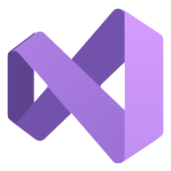

# AI Engineering Fluency

(Previously known as the "GitHub Copilot Token Tracker")


Track your GitHub Copilot token usage and AI Fluency across VS Code, Visual Studio, and the command line. All data is read from local session logs — nothing leaves your machine unless you opt in to cloud sync.

[](https://github.com/rajbos/ai-engineering-fluency/actions/workflows/build.yml)

## Supported AI engineering tools

- VS Code + GitHub Copilot (Stable, Insiders, Exploration)
- VSCodium / Cursor
- GitHub Copilot CLI
- JetBrains IDEs + GitHub Copilot
- Continue
- OpenCode
- Crush
- Claude Code (Anthropic)
- Gemini CLI (Google)
- Claude Desktop Cowork (Anthropic)
- Mistral Vibe
- Visual Studio + GitHub Copilot

<p align="left">
  &nbsp;
  &nbsp;
  &nbsp;
  <picture>
    <source media="(prefers-color-scheme: dark)" srcset="assets/tool-logos/github-copilot-dark.svg" />
    
  </picture>&nbsp;
  &nbsp;
  &nbsp;
  &nbsp;
  &nbsp;
  &nbsp;
  &nbsp;
  &nbsp;
  
</p>

---

## Pick your tool

### 🖥️ VS Code Extension (Chromium)

Real-time token usage in the status bar, fluency score dashboard, usage analysis, cloud sync, and more. Works with all Chromium-based VS Code forks — VS Code, Windsurf, Cursor, VSCodium, Trae, Kiro, Void, and more.

[](https://marketplace.visualstudio.com/items?itemName=RobBos.copilot-token-tracker) [](https://marketplace.visualstudio.com/items?itemName=RobBos.copilot-token-tracker) [](https://open-vsx.org/extension/RobBos/copilot-token-tracker) [](https://open-vsx.org/extension/RobBos/copilot-token-tracker)

```bash
# Install from the VS Code Marketplace
ext install RobBos.copilot-token-tracker
```

<details>
<summary>📦 Install in other Chromium-based editors (Open VSX)</summary>

```bash
# VSCodium
codium --install-extension RobBos.copilot-token-tracker

# Code OSS
code --install-extension RobBos.copilot-token-tracker

# Windsurf
windsurf --install-extension RobBos.copilot-token-tracker

# Cursor
cursor --install-extension RobBos.copilot-token-tracker

# Trae (ByteDance)
trae --install-extension RobBos.copilot-token-tracker

# Kiro (AWS)
kiro --install-extension RobBos.copilot-token-tracker

# Void
void --install-extension RobBos.copilot-token-tracker
```

</details>

📖 [Full VS Code extension documentation](docs/vscode-extension/README.md)

---

### 🐦 JetBrains IDE Plugin (awaiting JetBrains Marketplace approval)

Token usage and fluency dashboards inside any JetBrains IDE (IntelliJ IDEA, Rider, PyCharm, WebStorm, GoLand, RubyMine, CLion, …). Built as a thin Kotlin/JCEF host that reuses the same webview bundles as the VS Code extension and the same bundled CLI as the Visual Studio extension.

📖 [JetBrains plugin docs](jetbrains-plugin/README.md) · [Debugging guide](jetbrains-plugin/DEBUGGING-GUIDE.md)

---

### 🏗️ Visual Studio Extension

Token usage tracking inside Visual Studio 2022+, reading Copilot Chat session files directly.

[](https://marketplace.visualstudio.com/items?itemName=RobBos.AIEngineeringFluency)

📖 [Full Visual Studio extension documentation](docs/visual-studio/README.md)

---

### ⌨️ CLI

Run anywhere with Node.js — no editor required. Get usage stats, fluency scores, and environmental impact from the terminal.

[](https://www.npmjs.com/package/@rajbos/ai-engineering-fluency)

```bash
npx @rajbos/ai-engineering-fluency stats
```

📖 [Full CLI documentation](docs/cli/README.md)

---

### 🔗 Self-Hosted Sharing Server

Share usage data with your team without an Azure account. Run a lightweight API server
on your own infrastructure — team members configure a single endpoint URL and upload
automatically via their existing GitHub session.

- **Zero Azure required** — SQLite + Docker, runs anywhere
- **Auth via GitHub** — reuses the session already held by VS Code/Copilot, no API keys
- **Optional org gating** — restrict uploads to GitHub org members
- **Web dashboard** — see aggregated usage across your team

```yaml
# docker-compose.yml
services:
  sharing-server:
    image: ghcr.io/rajbos/copilot-sharing-server:latest
    ports:
      - "3000:3000"
    environment:
      - GITHUB_CLIENT_ID=...
      - GITHUB_CLIENT_SECRET=...
      - SESSION_SECRET=...
      - BASE_URL=https://copilot.example.com
    volumes:
      - sharing_data:/data
volumes:
  sharing_data:
```

```json
// VS Code settings — the only thing team members configure
{
  "aiEngineeringFluency.backend.sharingServer.enabled": true,
  "aiEngineeringFluency.backend.sharingServer.endpointUrl": "https://copilot.example.com"
}
```

📖 [Setup & configuration guide](docs/sharing-server/README.md) · [Server developer docs](sharing-server/README.md)

---

## Contributing

Interested in contributing? Check out our [Contributing Guide](CONTRIBUTING.md) for:

- 🐳 **DevContainer Setup** — Isolated development environment
- 🔧 **Build & Debug Instructions** — How to run and test locally
- 📋 **Code Guidelines** — Project structure and development principles
- 🚀 **Release Process** — CI/CD pipelines and automated releases

We welcome contributions of all kinds — bug fixes, new features, documentation improvements, and more!
