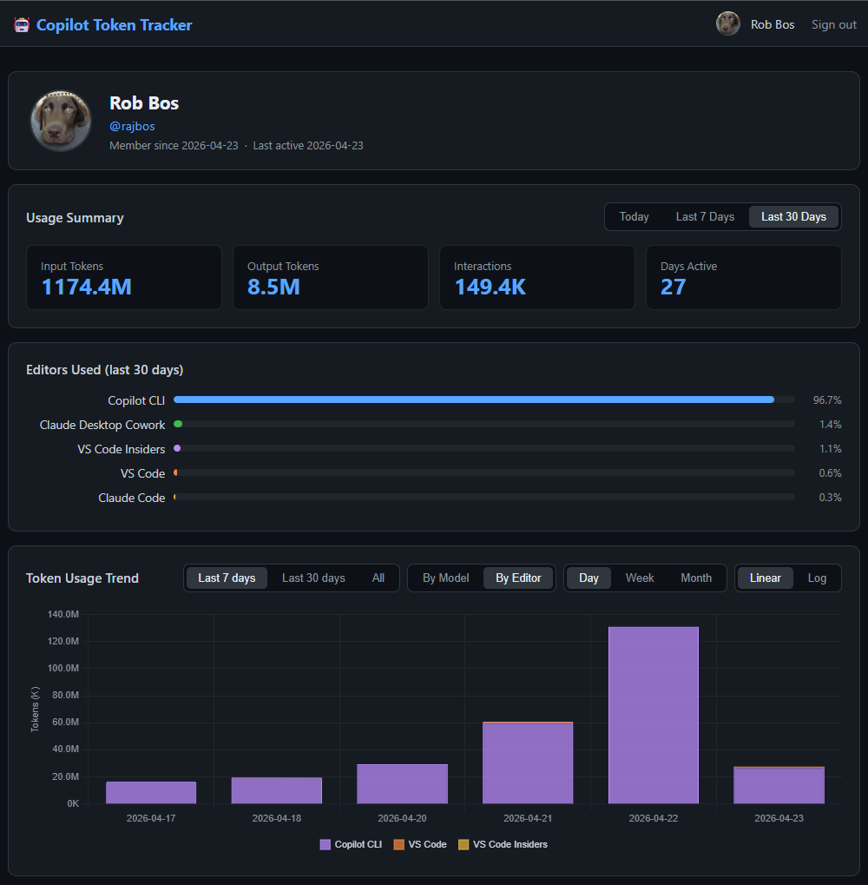

# Self-Hosted Sharing Server

> **Opt-in & self-hosted** — This feature is entirely optional. Nothing is shared unless
> you deploy your own server and explicitly enable the setting in VS Code. No data is
> sent to any third-party service.

The sharing server lets you aggregate Copilot token usage across a team on infrastructure
you own. It is a lightweight Node.js API backed by SQLite — run it with Docker on any
machine, point your team's VS Code extensions at it, and get a shared dashboard without
needing an Azure account.

## What it does

```
┌──────────────────┐         ┌──────────────────┐         ┌────────────────┐
│  VS Code / CLI   │──POST──▶│  Sharing Server   │──read──▶│  Web Dashboard │
│  (auto-uploads)  │ Bearer  │  (your infra)     │ SQLite  │  (GitHub login)│
└──────────────────┘ token   └──────────────────┘         └────────────────┘
```

1. **Upload** — The VS Code extension already holds a GitHub OAuth token (the same one
   used by Copilot). When you enable the sharing server setting, the extension
   automatically uploads daily usage rollups to your server. No new login, no API keys.
2. **Store** — The server validates the GitHub token, identifies the user, and upserts
   the rollup into a local SQLite database.
3. **View** — Team members sign in to the web dashboard with GitHub OAuth and see their
   own usage — input/output tokens, interactions, days active, editor breakdown, and
   usage trends over time.

## Dashboard preview



The web dashboard shows per-user usage summaries with time-range filters (Today /
Last 7 Days / Last 30 Days), an editor breakdown chart, and a token usage trend graph
grouped by editor or model.

---

## Setup guide

### Prerequisites

- Docker (or Node.js ≥ 22.5 if running without Docker)
- A [GitHub OAuth App](https://github.com/settings/developers) — needed for the web
  dashboard login

### 1. Create a GitHub OAuth App

1. Go to **GitHub → Settings → Developer settings → OAuth Apps → New OAuth App**
2. Fill in:
   - **Application name**: `Copilot Token Tracker` (or any name you like)
   - **Homepage URL**: `https://your-server.example.com`
   - **Authorization callback URL**: `https://your-server.example.com/auth/github/callback`
3. Copy the **Client ID** and generate a **Client Secret**

### 2. Deploy with Docker Compose

Create a `docker-compose.yml`:

```yaml
services:
  sharing-server:
    image: ghcr.io/rajbos/copilot-sharing-server:latest
    ports:
      - "3000:3000"
    environment:
      - GITHUB_CLIENT_ID=your_client_id
      - GITHUB_CLIENT_SECRET=your_client_secret
      - SESSION_SECRET=a_long_random_string_min_32_chars
      - BASE_URL=https://your-server.example.com
      # Optional: restrict to members of a specific GitHub org
      # - ALLOWED_GITHUB_ORG=your-org-name
    volumes:
      - sharing_data:/data
    restart: unless-stopped

volumes:
  sharing_data:
```

> **Tip**: Generate `SESSION_SECRET` with `openssl rand -hex 32`.

Start the server:

```bash
docker compose up -d
```

Verify it's running:

```bash
curl https://your-server.example.com/health
# → {"status":"ok","timestamp":"..."}
```

### 3. Configure the VS Code extension

Add these settings in VS Code (JSON):

```json
{
  "aiEngineeringFluency.backend.sharingServer.enabled": true,
  "aiEngineeringFluency.backend.sharingServer.endpointUrl": "https://your-server.example.com"
}
```

Or search for **AI Engineering Fluency: Sharing Server** in the Settings UI.

That's it. The extension starts uploading daily rollups automatically — no extra
authentication prompt, no API keys. It reuses your existing GitHub session from VS Code.

---

## Environment variables

| Variable | Required | Default | Description |
|---|---|---|---|
| `GITHUB_CLIENT_ID` | ✅ | — | GitHub OAuth App client ID |
| `GITHUB_CLIENT_SECRET` | ✅ | — | GitHub OAuth App client secret |
| `SESSION_SECRET` | ✅ | — | Random secret for signing session cookies (≥ 32 chars) |
| `BASE_URL` | ✅ | — | Public URL of the server (no trailing slash) |
| `PORT` | ❌ | `3000` | HTTP listen port |
| `DB_PATH` | ❌ | `/data/sharing.db` | SQLite database file path |
| `ALLOWED_GITHUB_ORG` | ❌ | *(any user)* | Restrict uploads and dashboard to members of this GitHub org |

---

## How authentication works

The sharing server does **not** issue its own API keys.

- **Data uploads** (from the VS Code extension) use a **Bearer token** — the same
  GitHub OAuth token already held by VS Code. The server validates it by calling
  `GET https://api.github.com/user` and caches the result for 10 minutes.
- **Web dashboard** login uses a standard **GitHub OAuth flow** (the OAuth App you
  created in step 1). Users sign in via the browser and receive a signed session cookie.

If `ALLOWED_GITHUB_ORG` is set, both uploads and dashboard access are restricted to
members of that GitHub organization.

---

## Privacy & data

- **Opt-in only** — No data is uploaded unless you explicitly enable the setting and
  provide a server URL.
- **Self-hosted** — The server runs on your infrastructure. Data never leaves your
  network (unless you expose the server publicly).
- **Identified mode** — Every upload is linked to a GitHub user ID. There is no
  anonymous or pseudonymous mode (unlike the Azure Storage backend).
- **Workspace/machine names** — Included or excluded based on the extension's
  `shareWorkspaceMachineNames` setting (off by default).
- **Rollups only** — The extension sends daily aggregates (tokens, interactions, model
  names), not raw prompts or completions.

---

## Backup

The entire server state lives in a single SQLite file (`/data/sharing.db` by default).
Back it up with any file copy tool or:

```bash
sqlite3 /data/sharing.db .dump > backup.sql
```

---

## Running without Docker

See the [sharing server README](../../sharing-server/README.md) for instructions on
building from source and running locally with Node.js.
