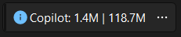
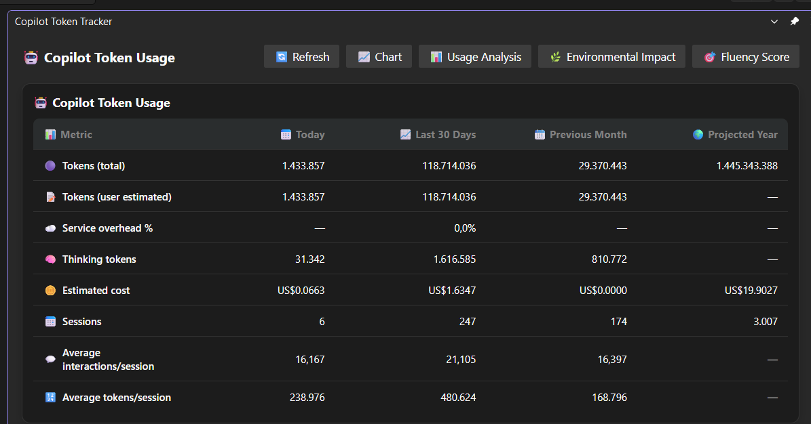

# Copilot Token Tracker — Visual Studio Extension

Tracks your GitHub Copilot token usage directly inside Visual Studio 2022+. Reads local Copilot Chat session files and displays usage statistics in a dedicated tool window.

> **Status**: Early access / active development. Core tracking is functional; some features available in the VS Code extension are still in progress.

## Install

The extension will be published to the [Visual Studio Marketplace](https://marketplace.visualstudio.com/vs). Until then, build from source (see [Contributing](../../CONTRIBUTING.md)).

---

## Features

- Token usage tracking from Visual Studio Copilot Chat session files
- Today's and monthly token counts displayed in a tool window
- Per-model usage breakdown

> **Note on token counts**: Visual Studio Copilot Chat session files store prompts and responses as plain text but do not include the actual LLM token counts used by the API. All numbers shown are **estimated** from prompt and response text length using model-specific character-to-token ratios.

---

## Screenshots

Features:

1. Toolbar with found token counts in the format `X | Y`
Which is today: X tokens | last 30-days: Y tokens



2. Detailed usage breakdown in the tool window, showing estimated tokens by model and date.


---

## Supported VS Versions

- Visual Studio 2022 (v17.x and later)

---

## Session File Location

Visual Studio Copilot Chat stores session files in:

```
<solution folder>\.vs\<solution name>.<ext>\copilot-chat\<hash>\sessions\<uuid>
```

The extension automatically discovers all sessions under the `.vs` folder for each open solution.

---

## Known Limitations

- Token counts are **estimated**, not actual LLM API counts. See the note above.
- Features available in the VS Code extension that are not yet available here:
  - Cloud backend (Azure Storage sync)
  - Usage Analysis Dashboard
  - Copilot Fluency Score
  - Export / social sharing
  - Diagnostic reporting panel

---

## Feedback

Please open an issue on [GitHub](https://github.com/rajbos/github-copilot-token-usage/issues) for bugs or feature requests specific to the Visual Studio extension.
